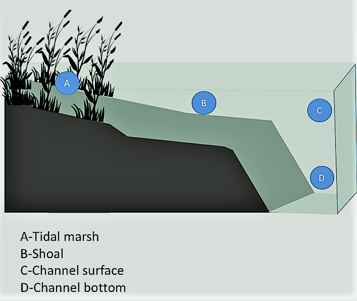

```{r setup, include=FALSE}
knitr::opts_chunk$set(echo = TRUE)
```

# Outline of manuscript work

- Sampled habitats

<!--  -->

```{r graphics, fig.align='center', echo=FALSE, out.width='50%'}

```

- Data Cleaning
- Analysis: [Exercise_1](Exercise_1.html)
- Mapping
- Discussion

# New Section

I am adding a new section to a forked version of J test.

I hope this works.

# Bibliography